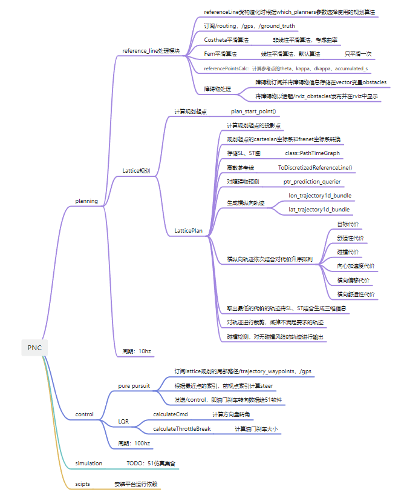

# Dust
An autonomous vehicle planning and control software's frame used by beihang university.
<!--
1. 问题
1.静态障碍物car的sl boundary怎么算的？
obstacle->polygon_points
2.planning节点在运行后频率大约在10hz，但是一旦启动control节点频率就会直线下降，这是为啥？
-->

# Planning and Control
An autonomous vehicle planning and control software's frame.

<a name="readme-top"></a>


<!-- PROJECT LOGO -->
<br />
<div align="left">
  <!-- <a href="https://github.com/othneildrew/Best-README-Template">
    
  </a> -->

  <p align="left">
    <b>PNC</b>
    <!-- <br /> -->
    <!-- <a href="https://github.com/othneildrew/Best-README-Template"><strong>Explore the docs »</strong></a>
    <br /> -->
    <br />
    <a href="https://www.bilibili.com/video/BV1Fg4y1n7SY/?vd_source=b7830616317d04289db089c940d49514">View Demo</a>
    ·
    <a href="https://github.com/yizhiweimengxiangfendoudefeifei/Dust/issues">Report Bug</a>
    ·
    <a href="https://github.com/yizhiweimengxiangfendoudefeifei/Dust/pulls">Request Feature</a>
    <br>
  </p>
</div>


<!-- ABOUT THE PROJECT -->
## About PNC
根据Apollo算法修改的规划控制算法，规划目前支持Lattice，控制支持LQR和pure_pursuit，以后考虑规划加入em planner。  
现在的算法框架是基于ROS改写，仿真平台使用国产软件51world。  
## Data flow  
  

<!-- GETTING STARTED -->
## Getting Started

### Prerequisites

Alternatively, simply perform the following steps：
在scripts文件夹下执行以下命令。
* ros

  ```sh
  sudo ./install_ros.sh
  ```
* ADOLC

  ```sh
  sudo ./install_adolc.sh
  ```
* OSQP
  ```sh
  sudo ./install_osqp.sh
  ```
* IPOPT
  ```sh
  sudo ./install_ipopt.sh
  ```
* qp_oases
  ```sh
  sudo ./install_qp_oases.sh
  ```
* YAML
  ```sh
  sudo ./install_yaml.sh
  ```

### Build And Run PNC

1. 修改yaml文件地址
   ```sh
   YAML::Node config = YAML::LoadFile("/media/navigation/dust/sg/Dust/src/modules/planning/config/configs.yaml");
   ```
2. ros build
   ```sh
   catkin build
   ```

### Run PNC
1. run planning package:
   ```sh
   roslaunch planning planning.launch
   ```

2. run control package

   ```sh
   roslaunch control control.launch
   ```
3. run pnc package
  
   ```sh
   roslaunch planning pnc.launch
   ```

<!-- USAGE EXAMPLES -->
### 51world simulation
1.  开发环境
    ```sh
    wget -O - https://apt.llvm.org/llvm-snapshot.gpg.key | sudo apt-key add -
    sudo apt-add-repository "deb http://apt.llvm.org/xenial/ llvm-toolchain-xenial-6.0 main"
    sudo apt-get update
    # install dependence
    sudo apt-get install uuid-dev libx11-dev libxrandr-dev libsdl2-dev libx11-dev libc++-dev abi++-dev
    ```
2.  Compile

    Run the following command in the container:
    ```sh
    安装SimOne后，打开SimOneAPI文件夹，进入Tutorial-Build目录；运行rebuild_release.sh，生成可执行文件在SimOneAPI/Tutorial/Build下
    make
    export LD_LIBRARY_PATH=$LD_LIBRARY_PATH:/home/navigation/linux/simone/SimOneAPI_glf/lib/Linux64
    ```
    
3. Run

    在run文件夹中运行.
    ```sh
    ./trans_ros_node
    ```

### Result
If you successfully built and ran, you should see this in this video:   
<a href="https://www.bilibili.com/video/BV1Fg4y1n7SY/?vd_source=b7830616317d04289db089c940d49514">Demo</a>


<!-- CONTRIBUTING -->
<!--
## Contributing

Contributions are what make the open source community such an amazing place to learn, inspire, and create. Any contributions you make are **greatly appreciated**.

If you have a suggestion that would make this better, please fork the repo and create a pull request. You can also simply open an issue with the tag "enhancement".
Don't forget to give the project a star! Thanks again!

1. Fork the Project
2. Create your Feature Branch (`git checkout -b feature/AmazingFeature`)
3. Commit your Changes (`git commit -m 'Add some AmazingFeature'`)
4. Push to the Branch (`git push origin feature/AmazingFeature`)
5. Open a Pull Request
-->

<!-- LICENSE -->
## License

Distributed under the Apache-2.0 License. See `LICENSE.txt` for more information.

In addition, We have kept the LICENSE of project [PNC](https://github.com/yizhiweimengxiangfendoudefeifei/Dust) in carla_apollo_bridge directory.


<!-- ACKNOWLEDGMENTS -->
## Acknowledgments

The co-simulation is modified on the basis of the following, thank you here.

* [Apollo](https://github.com/ApolloAuto/apollo)

<p align="right">(<a href="#readme-top">back to top</a>)</p>


